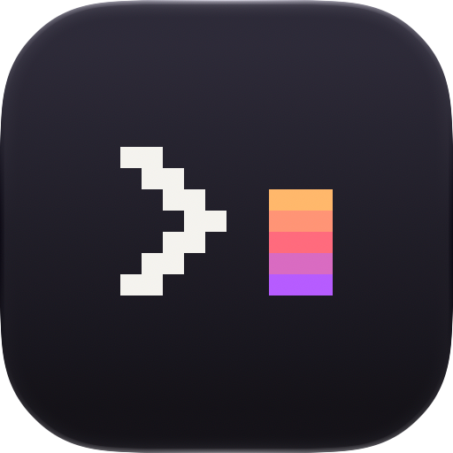

# App icon



A prompt and a cursor: a terminal, waiting for you. The chevron is a quiet
warm white. The cursor is the icon's only colour: a peach → coral → violet
ramp laid down one pixel row at a time, so the gradient is itself made of
pixels. Everything else is a near-black background with a hint of plum,
which picks up the violet at the bottom of the cursor.

## Source of truth

`src/design.ts` → `SHIP` holds the pixel grids (ASCII), the pixel size, the
spacing and every colour. Nothing else decides what ships.

```bash
make icon                     # from the repo root; same as the line below
cd design/icon && bun run build
```

`build` writes `macos/ccterm/AppIcon.icon` from scratch. That's an Icon
Composer document: `icon.json`, plus one SVG per layer. Don't edit it by hand
or in Icon Composer; your edits will be overwritten on the next build.
With Xcode 26+ installed, `build` also renders the document through Xcode's
`ictool`. That's the same renderer the system uses: squircle mask, Liquid
Glass rim, and the Dark, Clear and Tinted appearances. The results go to
`out/review.png`, alongside the size ladder (256 → 16 px). Look at that sheet
before committing.

How the document is put together:

- **Background = the document's `linear-gradient` fill**, not a layer, so the
  system owns it in the dark, clear and tinted renditions.
- **Layers are `glass: false`.** The art is flat pixels, and refraction
  would soften the hard edges that make it read as pixel art.
- **Stepped ramps get a mid-colour underlay** of their whole silhouette
  (`pixel.ts`). At small sizes, the anti-aliased seams between differently
  coloured pixels then show that colour instead of the background.
- **Gradients interpolate in OKLab** (`color.ts`), so a warm → cool ramp stays
  saturated through the middle instead of going grey.
- For older macOS versions, Xcode's `actool` derives `AppIcon.icns` from the
  same document. Nothing extra is needed.

## Tuning and exploring

```bash
bun run variants   # SHIP ± edits (src/variants.ts), each through .icon → ictool
bun run sheet      # concept contact sheets (src/explore/), quick resvg mock
```

`src/explore/` records how the design got here. Round 1 compared seven
concepts: prompt + underscore, prompt + block, prompt + sparkle, speech
bubble, gradient bubble, terminal window, and caret. Round 2 tuned the
cursor's proportions, and the palette matrix compared 4 backgrounds × 5
ramps. `variants.ts` settled the last details with real system renders: a
48-unit pixel, a 2-pixel gap and a ¼-pixel optical lift.

`out/` is scratch output and is ignored by git.
